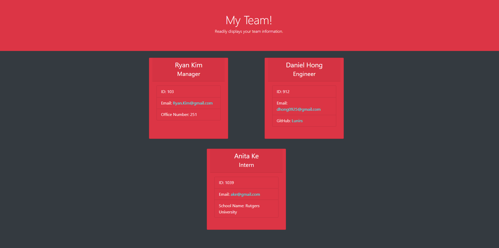

# Team Profile Generator


## Description

Ever wanted a readily available site where you can update your teammates and have access to their information at all times? This application does just that! By answering just a couple questions, you will be able to input your team's information and have that info available.

## Table of Contents

1. [Installation](#installation)
2. [Usage](#usage)
3. [Tests](#tests)
4. [Questions](#questions)
5. [License](#license)

## Installation

In order to install and use this application, you would need to run the following code:

```
npm i
```

This will install inquirer which will be the main method to ask you questions for the inputs. This will also install jest which you will need for the [Tests](#tests) section later on!

## Usage

Once all of the node packages are installed, you will be able to  run the application by utilizing the following code block.

```
node index
```

You will then be prompted with several questions. Once you have successfully answered all of the questions, an index.html file will be generated in your dist folder for you to view!

### Video Link Tutorial

The following link is a video tutorial which will demonstrate what a user will go through when using this application.

[Click here](https://www.youtube.com/watch?v=fVn6asuGJCw) to be redirected to the video!

### Screenshot of Generated Webpage Through Application



## Tests

I have created 4 different tests to see if each class's constructors and functions are working properly.

1. Employee.test.js
2. Manager.test.js
3. Engineer.test.js
4. Intern.test.js

In order to run the test, you can run the following code block.

```
npm test
```

The test is set to watchAll and will update as you save.

## Questions

If you have any questions, please feel free to reach out to me via:

1. Email: dhong0925@gmail.com
2. GitHub: Lunirs

## License

Licensed under the MIT license.

## Credits

Copyright © Daniel Hong All rights reserved.
